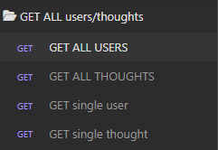
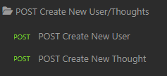
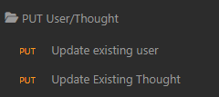
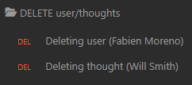
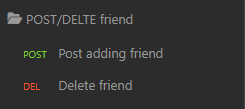
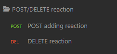

# SocialDose-API
MongoDB is a popular choice for many social networks due to its speed with large amounts of data and flexibility with unstructured data. This project builds an API for a social network web application where users can share their thoughts, react to friends’ thoughts, and create a friend list.

**User Story:** 
AS A social media startup   
I WANT an API for my social network that uses a NoSQL database  
SO THAT my website can handle large amounts of unstructured data

**Acceptance Criteria:**  
GIVEN a social network API  
WHEN I enter the command to invoke the application  
THEN my server is started and the Mongoose models are synced to the MongoDB database  
WHEN I open API GET routes in Insomnia for users and thoughts  
THEN the data for each of these routes is displayed in a formatted JSON  
WHEN I test API POST, PUT, and DELETE routes in Insomnia  
THEN I am able to successfully create, update, and delete users and thoughts in my database  
WHEN I test API POST and DELETE routes in Insomnia  
THEN I am able to successfully create and delete reactions to thoughts and add and remove friends to a user’s friend list  

  

  ## Table of Contents
  - [Installation](#installation)
  - [Usage](#usage)
  - [Technologies](#technologies)
  - [Contributing](#contributing)
  - [Questions](#questions)
  - [License](#license)
  

  ## Installation
  You will need to start by having Node.js downloaded on your local machine. Preferably version 18.4.0.  

  THEN you run npm install for all of the packages listed below.  

 **Dependencies:**
  - Dotenv
  - Express
  - Mongoose
  

  ***Dev-Dependencies:***
  - Nodemon

  

  ## Usage
 Demo video of application: https://drive.google.com/file/d/1_F4EDyZYJi2q_Bfcg8IwpA-nV3ETN_YH/view 

 
The demo video is a live recording going through starting the application server (using npm start in the terminal) executing all of these routes one-by-one

- GET Routes (All users, thoughts & Single user, thoughts)

  

- POST routes (Creating new user & Creating new thoughts)

  

- PUT routes (Updating user & thoughts)

   

- DELETE routes (Deleting user & thoughts)

   

- POST/DELETE routes (Creating friend & Deleting friend)

   

- POST/DELETE (Creating reaction to thought & Deleting reaction to thought)

   

  
  

  ## Technologies
 - Dotenv (https://www.npmjs.com/package/dotenv)
 - Express.js (https://www.npmjs.com/package/express)
 - Nodemon (https://www.npmjs.com/package/nodemon)
 - Node.js (https://nodejs.org/en/)
 - Mongoose (https://www.npmjs.com/package/mongoose)
 - Insomnia (https://insomnia.rest/)
 

 

 ## Contributing
NPM @ https://www.npmjs.com/package/inquirer  
Dotenv @ https://www.npmjs.com/package/dotenv  

 

 ## Questions
 If you have questions, comments, or concerns please reach me at https://github.com/fabien1313
 or
 fabienmoreno1331@yahoo.com

 ## License
 **License:** MIT

Copyright (c) 2023 fabien1313

Permission is hereby granted, free of charge, to any person obtaining a copy
of this software and associated documentation files (the "Software"), to deal
in the Software without restriction, including without limitation the rights
to use, copy, modify, merge, publish, distribute, sublicense, and/or sell
copies of the Software, and to permit persons to whom the Software is
furnished to do so, subject to the following conditions:

The above copyright notice and this permission notice shall be included in all
copies or substantial portions of the Software.

THE SOFTWARE IS PROVIDED "AS IS", WITHOUT WARRANTY OF ANY KIND, EXPRESS OR
IMPLIED, INCLUDING BUT NOT LIMITED TO THE WARRANTIES OF MERCHANTABILITY,
FITNESS FOR A PARTICULAR PURPOSE AND NONINFRINGEMENT. IN NO EVENT SHALL THE
AUTHORS OR COPYRIGHT HOLDERS BE LIABLE FOR ANY CLAIM, DAMAGES OR OTHER
LIABILITY, WHETHER IN AN ACTION OF CONTRACT, TORT OR OTHERWISE, ARISING FROM,
OUT OF OR IN CONNECTION WITH THE SOFTWARE OR THE USE OR OTHER DEALINGS IN THE
SOFTWARE.